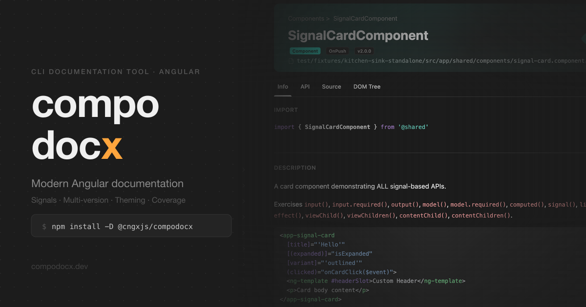

# compodocx-website

The marketing and reference site for [`@cngxjs/compodocx`](https://github.com/cngxjs/compodocx) — a modern documentation generator for Angular applications. Standalone-first, signal-aware, themeable.

[](https://github.com/cngxjs/compodocx-website/actions/workflows/deploy.yml)
[](https://compodocx.dev)
[](https://www.npmjs.com/package/@cngxjs/compodocx)
[](#license)
[](https://compodocx.dev)

[](https://compodocx.dev)

## What this site is

A 17-route static site:

- **Landing** — feature grid, screenshots, themes, getting-started, FAQ.
- **Guides hub** + **13 reference guides** covering install, options, usage, themes, JSDoc tags, routing, coverage, playground, tab configuration, comments, live examples, tips, and the full feature surface.
- **Impressum** — Austrian legal disclosure (§5 ECG / §25 MedienG).
- **Custom 404** — branded fallback with quick links to popular guides.

Built with [Astro 6](https://astro.build), [Tailwind v4](https://tailwindcss.com), and zero client-side framework. The only JavaScript on the site is ~530 bytes of vanilla TypeScript for the dark-mode toggle, theme picker, copy-to-clipboard, lightbox, and tab widget.

## Local development

```bash
npm install        # Node >= 22.12 required
npm run dev        # http://localhost:4321 — live reload, debug overlay
```

## Build

```bash
npm run build      # production build → dist/
npm run preview    # serve dist/ locally on http://localhost:4321
npm run lint       # astro check + tsc --noEmit
npm run format     # prettier --write .
```

`npm run preview` is the closest local approximation of the deployed site. The Astro dev server has different routing fallbacks than GitHub Pages.

## Deploy

Every pr to `develop` triggers `.github/workflows/deploy.yml`:

1. `npm ci` → `npm run lint` → `npm run build`
2. `peaceiris/actions-gh-pages@v4` publishes `./dist` to the `gh-pages` branch
3. GitHub Pages serves `gh-pages` to https://compodocx.dev (custom domain, Let's Encrypt cert, HTTPS enforced)

PRs run the same lint + build pipeline as a status check, but skip the publish step. Branch protection on `develop` requires the `build` check to pass.

## Asset pipelines

| Script                     | What it does                                                                           |
| -------------------------- | -------------------------------------------------------------------------------------- |
| `npm run sync:tokens`      | Pull design tokens from `cngxjs/compodocx@develop` into `src/styles/vendor/compodocx/` |
| `npm run sync:screenshots` | Playwright captures of the local compodocx output (requires `COMPODOCX_REPO=<path>`)   |
| `npm run og:gen`           | Regenerate `og-image.png`, `apple-touch-icon.png`, `favicon.png` via Sharp             |
| `npm run lqip:gen`         | Regenerate `src/assets/screenshots/lqip.json` blur-up placeholders                     |

## Project layout

```
src/
  pages/              17 routes (landing, guides hub, 13 guides, impressum, 404)
  layouts/            Layout.astro (chrome) + FeaturesLayout.astro (guide pages)
  components/         all .astro — NavBar, Hero, FeatureGrid, ThemesGrid, Footer, BackToTop, …
  styles/             global.css + vendored compodocx tokens (8 themes total)
  scripts/            ~530 B of vanilla TS — dark-mode, theme-switcher, copy, tabs, lightbox
  assets/             screenshots (AVIF + WebP via <Image>), logos, theme thumbnails
public/               favicon, manifest, og-image, robots.txt, CNAME
scripts/              token sync, screenshot capture, og + lqip generators
```

For deeper conventions (theming system, JSON-LD strategy, ARIA patterns, the inline theme bundle, view-transition state preservation), see [`CLAUDE.md`](CLAUDE.md).

## Contributing

Pull requests are welcome — typo fixes, content additions, visual improvements, accessibility fixes. See [`CONTRIBUTING.md`](CONTRIBUTING.md) for the workflow and what fits this repo.

Tool-specific feedback (CLI flags, JSDoc tag parsing, output structure) belongs in the [`@cngxjs/compodocx`](https://github.com/cngxjs/compodocx/issues) repo, not here.

## Security

See [`SECURITY.md`](SECURITY.md) for the disclosure process.

## License

Dual-licensed — different terms apply to source code and content:

- **Source code** (Astro components, scripts, build configuration, CSS) — [MIT](LICENSE).
- **Content** (guide pages, landing copy, screenshots, SVG mockups) — [CC BY 4.0](LICENSE-DOCS.md).

When attributing the content, link back to https://github.com/cngxjs/compodocx-website. The CC BY 4.0 attribution requirements are documented in `LICENSE-DOCS.md`.
